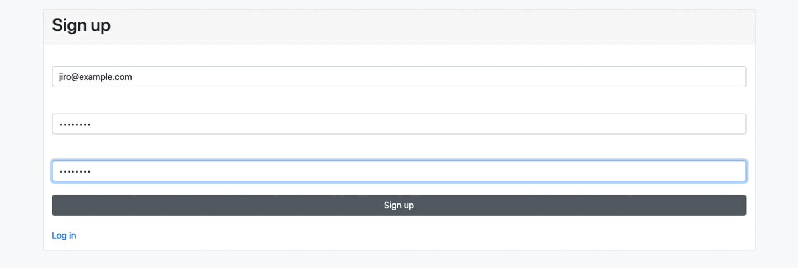

<div id="top"></div>

<!-- PROJECT SHIELDS -->
<!--
*** https://www.markdownguide.org/basic-syntax/#reference-style-links
-->

![app-shield]
![title-shield]

<!-- PROJECT IMAGE -->
<div align="center">
  
</div>

<!-- TABLE OF CONTENTS -->
<details>
  <summary>Table of Contents</summary>
  <ol>
    <li>
      <a href="#about-the-project">About The Project</a>
      <ul>
        <li><a href="#build-with">Build With</a></li>
        <li><a href="#gems-used">Gems Used</a></li>
        <li><a href="#er-diagram">ER Diagram</a></li>
      </ul>
    </li>
    <li>
      <a href="#getting-started">Getting Started</a>
      <ul>
        <li><a href="prerequisites">Prerequisites</a></li>
        <li><a href="installation">Installation</a></li>
      </ul>
    </li>
    <li><a href="#usage">Usage</a></li>
    <!-- <li><a href="#acknowledgments">Acknowledgments</a></li> -->
  </ol>
</details>

<!-- ABOUT THE PROJECT -->

## About The Project

This is an application with Ruby on Rails built out for practice purposes, which is a very simple, functional [Project Management][project-url]. For examples, please refer to the [Usage](#usage).
<br><br>

### Build With

- [Ruby](https://github.com/ruby/ruby)
- [Rails](https://github.com/rails/rails)
- [HTML](https://developer.mozilla.org/en-US/docs/Web/HTML)
- [Bootstrap](https://getbootstrap.com/)
- [PostgreSQL](https://www.postgresql.org/)
  <br><br>

### Gems Used

- [devise](https://rubygems.org/gems/devise) : Flexible authentication solution for Rails with Warden
- [nested_scaffold](https://rubygems.org/gems/nested_scaffold) : Nested scaffold generator for Rails
- [pry-byebug](https://rubygems.org/gems/pry-byebug) : Combine 'pry' with 'byebug'. Adds 'step', 'next', 'finish', 'continue' and 'break' commands to control execution.
  <br><br>

### Entity Relationship Diagram


<p align="right"><a href="#top">back to top</a></p>
<br><br>

<!-- GETTING STARTED -->

## Getting Started

Below are instructions on getting you a copy of the project up and running on your local machine for development purposes.
<br><br>

### Prerequisites

- bundler

  ```sh
  gem install bundler
  ```

<br><br>

### Installation

1. Clone the repo

   ```sh
   git clone https://github.com/Ikko-T/project-management.git
   ```

2. Change the directory

   ```sh
   cd project-management
   ```

3. Install the dependencies specified in Gemfile

   ```sh
   bundle install
   ```

4. Create a database

   ```sh
   rails db:create
   ```

<p align="right"><a href="#top">back to top</a></p>
<br><br>

<!-- USAGE EXAMPLES -->

## Usage



<p align="right"><a href="#top">back to top</a></p>

<!--MARKDOWN LINKS & IMAGES -->

[app-shield]: https://img.shields.io/badge/APP-Practice-blue
[title-shield]: https://img.shields.io/badge/Title-Project%20Management-yellow
[project-url]: https://project-management-production.herokuapp.com/
